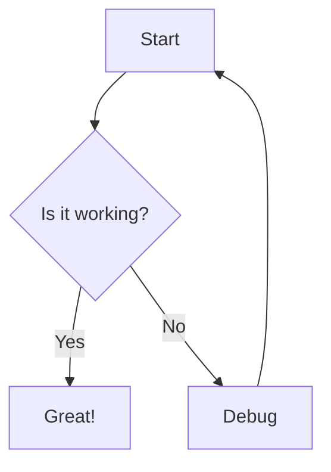

# Task: Add Mermaid Diagram Support

## Overview
Add Mermaid.js diagram rendering support to the Reading Mode and optionally Live Preview mode.

## Requirements

### 1. Install Dependencies
- Add `mermaid` package to dependencies
- Version: `^10.x` (latest stable)

### 2. Reading Mode Integration
- Detect code blocks with `mermaid` language identifier
- Render Mermaid diagrams in place of code blocks
- Handle rendering errors gracefully
- Support all Mermaid diagram types:
  - Flowcharts
  - Sequence diagrams
  - Class diagrams
  - State diagrams
  - Entity Relationship diagrams
  - User Journey diagrams
  - Gantt charts
  - Pie charts
  - Requirement diagrams
  - Gitgraph diagrams

### 3. Live Preview Mode Integration (Optional)
- Show rendered diagram in Live Preview when not editing
- Show markdown syntax when cursor is on the code block
- Similar to how other formatting works in Live Preview

### 4. Configuration
- Optional: Theme configuration (light/dark) to match VS Code theme
- Optional: Diagram scaling/sizing options

## Implementation Steps

1. **Install mermaid package**
   ```bash
   npm install mermaid@^10.0.0
   ```

2. **Update Reading Mode renderer** (`src/editors/readingMode.ts`)
   - Import mermaid
   - Initialize mermaid with appropriate config
   - Add post-processing step after markdown render
   - Find all `<code class="language-mermaid">` blocks
   - Replace with rendered SVG diagrams

3. **Add error handling**
   - Catch mermaid render errors
   - Display error message in place of diagram
   - Log errors for debugging

4. **Test with examples**
   - Create test files with various diagram types
   - Verify rendering in Reading Mode
   - Test error cases (invalid syntax)

## Testing Checklist

- [ ] Flowchart renders correctly
- [ ] Sequence diagram renders correctly
- [ ] Class diagram renders correctly
- [ ] State diagram renders correctly
- [ ] ER diagram renders correctly
- [ ] Gantt chart renders correctly
- [ ] Pie chart renders correctly
- [ ] Invalid mermaid syntax shows error gracefully
- [ ] Theme matches VS Code light/dark mode
- [ ] Diagrams are properly sized and scrollable if needed

## Files to Modify

- `package.json` - Add mermaid dependency
- `webview/editors/readingMode.ts` - Add mermaid rendering logic
- `webview/src/index.ts` - Initialize mermaid (if needed)

## Example Usage

Users should be able to write:

````markdown

````

And see it rendered as a diagram in Reading Mode.
